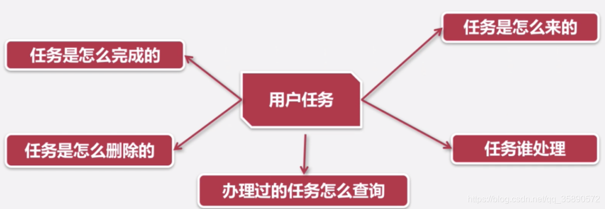
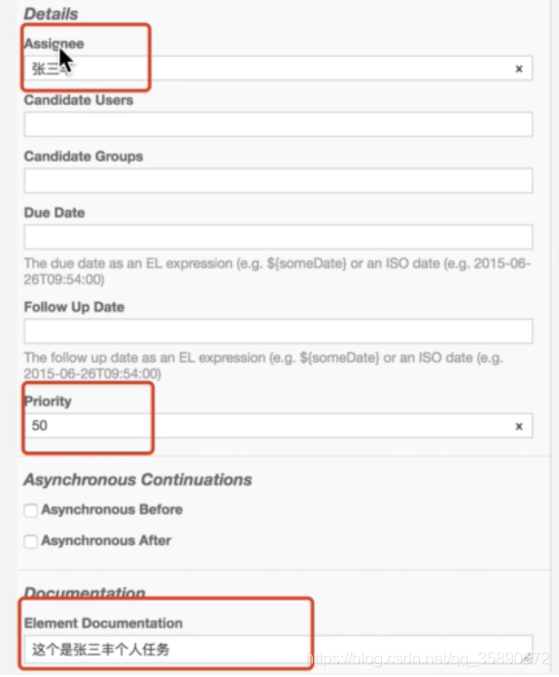
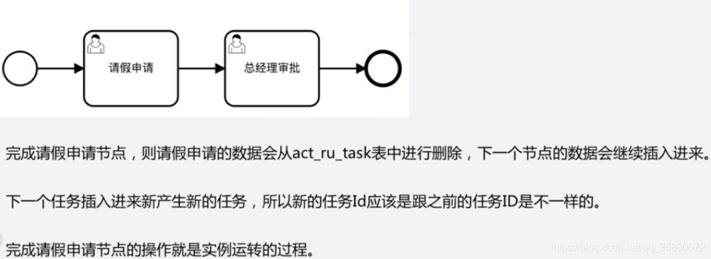
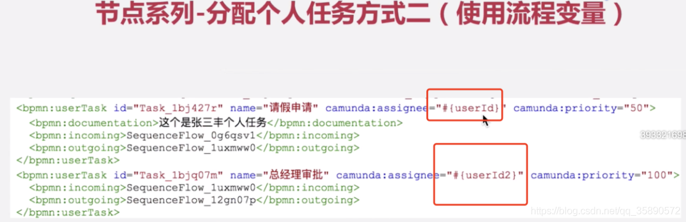
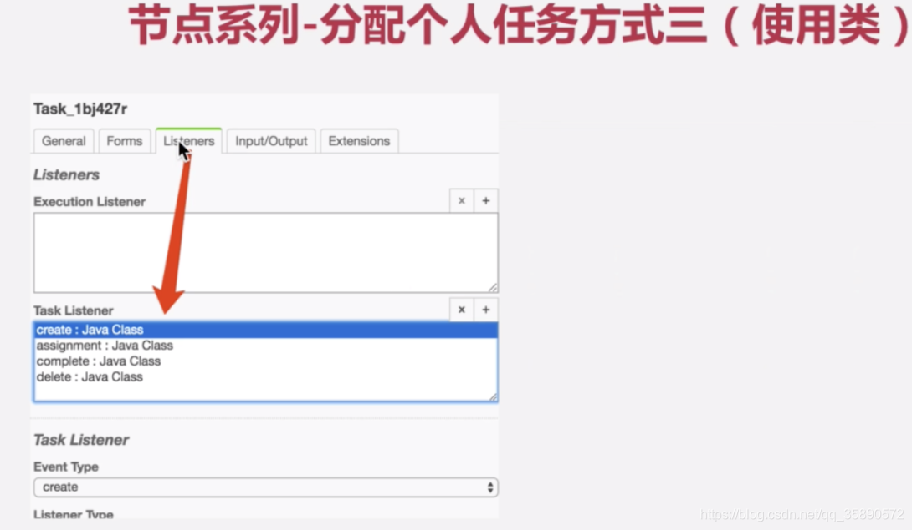
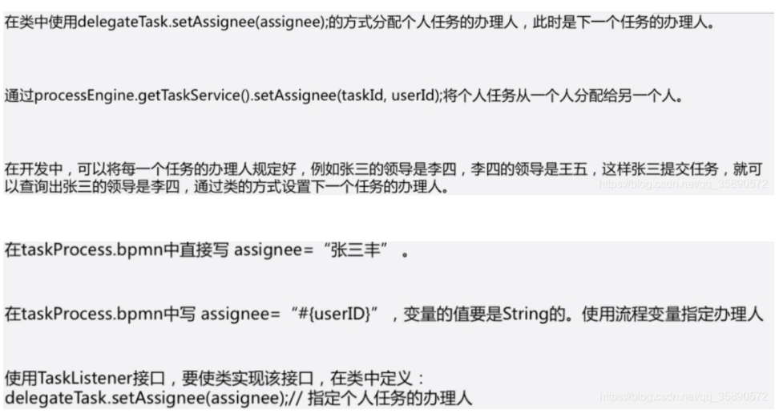
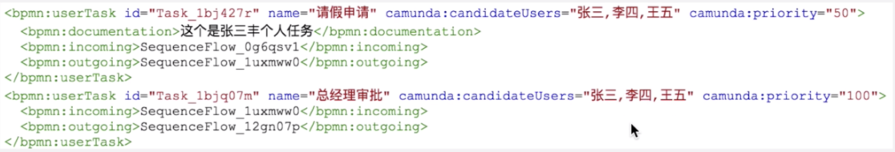
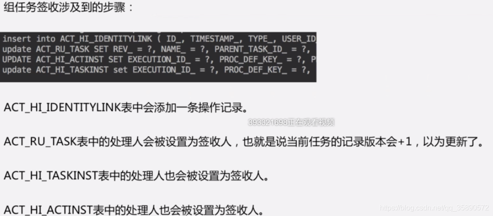
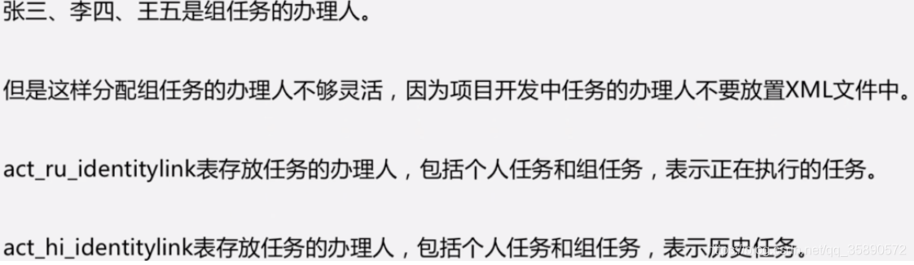
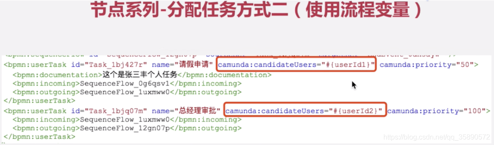

节点：开始节点、结束节点、活动节点、等待活动节点、不等待活动节点

任务：个人任务、组任务、任务认领、任务归还、监听器使用、角色组使用

##一、节点说明
开始节点：

结束节点：

节点说明：

##二、userTask任务的两种处理方式
用户个人任务：

###TaskService类


直接指定办理人： 

这样分配任务的办理人不够灵活，因为在项目中任务的办理人不是固定的，不应该写死在xml文件中。

个人任务查询与完成：

使用变量：


在启动流程时，需要指定变量，变量存在ACT_RU_VARIABLE中
```java
    @Test
    public void startProcessInstanceByKey() {
        Map<String, Object> variables = new HashMap<String, Object>();
        variables.put("userId", "张翠山");
        runtimeService.startProcessInstanceByKey("leave", variables);
    }


    /**
     * select distinct RES.REV_, RES.ID_, RES.NAME_,
     * RES.PARENT_TASK_ID_, RES.DESCRIPTION_, RES.PRIORITY_, RES.CREATE_TIME_, RES.OWNER_,
     * RES.ASSIGNEE_, RES.DELEGATION_, RES.EXECUTION_ID_, RES.PROC_INST_ID_, RES.PROC_DEF_ID_,
     * RES.CASE_EXECUTION_ID_, RES.CASE_INST_ID_, RES.CASE_DEF_ID_, RES.TASK_DEF_KEY_, RES.DUE_DATE_,
     * RES.FOLLOW_UP_DATE_, RES.SUSPENSION_STATE_, RES.TENANT_ID_
     * from ACT_RU_TASK RES WHERE ( 1 = 1 and RES.ASSIGNEE_ = ? ) order by RES.ID_ asc LIMIT ? OFFSET ?
     * <p>
     * 张三(String), 2147483647(Integer), 0(Integer)
     */
    @Test
    public void findMyTask() {
        List<Task> taskList = taskService.createTaskQuery().taskAssignee("张三").list();
        for (Task task : taskList) {
            System.out.println("#############");
            System.out.println(task.getId());
            System.out.println(task.getCreateTime());
            System.out.println(task.getPriority());
            System.out.println(task.getExecutionId());
            System.out.println("#############");
        }
    }

    @Test
    public void complete() {
        String taskId = "6906";
        taskService.complete(taskId);
    }

```

## 三、使用监听器
监听器分为任务监听器与执行监听器


用户个人任务分配使用类

```java
<bpmn:userTask id="Activity_1gf3mot" name="请假申请" camunda:priority="50">
      <bpmn:extensionElements>
        <camunda:taskListener class="com.demo.ch10.listener.MyTaskListener" event="create" />
        <camunda:taskListener class="com.demo.ch10.listener.MyTaskListener" event="assignment" />
      </bpmn:extensionElements>
      <bpmn:incoming>Flow_0zr2g6h</bpmn:incoming>
      <bpmn:outgoing>Flow_0iwf8m2</bpmn:outgoing>
</bpmn:userTask>
public class MyTaskListener implements TaskListener {
    public void notify(DelegateTask delegateTask) {
        System.out.println("#########");
        String eventName = delegateTask.getEventName();
        System.out.println(eventName);//create delete等
        int priority = delegateTask.getPriority();
        System.out.println(priority);
        //注意这里，如果不判断类型，则可能陷入死循环（如果配置了assignment类型的listener）
        if (eventName.equals("create")) {
            delegateTask.setAssignee("张太公");
        }
        System.out.println("#########");
    }
}

```

开始节点、连线等只有执行监听器，没有任务监听器，使用监听器，注意要规避死循环！


任务转让：
```java
 @Test
    public void setAssignee() {
        String taskId = "5503";
        String assignee = "张无极";
        //setAssignee会触发assignment类型的监听器
        taskService.setAssignee(taskId, assignee);
    }

```




##四、组任务设置
组任务定义：

组任务的ASSIGNEE_字段没有值，而对应的处理人存放在ACT_RU_IDENTITYLINK中，该表存了任务ID的值
组任务查询：
```java
 /**
     * select distinct RES.REV_, RES.ID_, RES.NAME_, RES.PARENT_TASK_ID_, RES.DESCRIPTION_,
     * RES.PRIORITY_, RES.CREATE_TIME_, RES.OWNER_, RES.ASSIGNEE_, RES.DELEGATION_, RES.EXECUTION_ID_,
     * RES.PROC_INST_ID_, RES.PROC_DEF_ID_, RES.CASE_EXECUTION_ID_, RES.CASE_INST_ID_, RES.CASE_DEF_ID_,
     * RES.TASK_DEF_KEY_, RES.DUE_DATE_, RES.FOLLOW_UP_DATE_, RES.SUSPENSION_STATE_, RES.TENANT_ID_
     * from ACT_RU_TASK RES
     * inner join ACT_RU_IDENTITYLINK I on I.TASK_ID_ = RES.ID_
     * WHERE ( 1 = 1 and ( RES.ASSIGNEE_ is null and I.TYPE_ = 'candidate' and ( I.USER_ID_ = ? ) ) ) order by RES.ID_ asc LIMIT ? OFFSET ?
     */
    @Test
    public void findGroupTask() {
        List<Task> taskList = taskService
                .createTaskQuery()
                .taskCandidateUser("张三")//指定候选人
                .list();
        for (Task task : taskList) {
            System.out.println("#############");
            System.out.println(task.getId());
            System.out.println(task.getCreateTime());
            System.out.println(task.getPriority());
            System.out.println(task.getExecutionId());
            System.out.println("#############");
        }
    }

```

根据任务反向查询处理人：
```java
    @Test
    public void getIdentityLinksForTask() {
        String taskId = "8208";
        List<IdentityLink> identityLinksForTask = taskService.getIdentityLinksForTask(taskId);
        for (IdentityLink identityLink : identityLinksForTask) {
            System.out.println("########");
            System.out.println(identityLink.getTaskId());
            System.out.println(identityLink.getProcessDefId());
            System.out.println(identityLink.getUserId());
            System.out.println("########");

        }
    }

```

查询历史任务处理人：
```java
    /**
     * select distinct RES.* from ACT_HI_IDENTITYLINK RES order by RES.ID_ asc LIMIT ? OFFSET ?
     */
    @Test
    public void createHistoricIdentityLinkLogQuery() {
        //查询历史权限表
        List<HistoricIdentityLinkLog> list = historyService.createHistoricIdentityLinkLogQuery()
                .list();
        for (HistoricIdentityLinkLog identityLinkLog : list) {
            System.out.println("###########");
            System.out.println(identityLinkLog.getOperationType());
            System.out.println(identityLinkLog.getUserId());
            System.out.println(identityLinkLog.getGroupId());
            System.out.println(identityLinkLog.getId());
            System.out.println("###########");
        }
    }

```


##五、组任务处理人三种设置方式
任务签收：
```java
    /**
     * insert into ACT_HI_IDENTITYLINK ( ID_, TIMESTAMP_, TYPE_, USER_ID_, GROUP_ID_, TASK_ID_, ROOT_PROC_INST_ID_, PROC_DEF_ID_, OPERATION_TYPE_, ASSIGNER_ID_, PROC_DEF_KEY_, TENANT_ID_, REMOVAL_TIME_) values (?, ?, ?, ?, ?, ?, ?, ?, ?, ?, ?, ?, ? )
     * update ACT_RU_TASK SET REV_ = ?, NAME_ = ?, PARENT_TASK_ID_ = ?, PRIORITY_ = ?, CREATE_TIME_ = ?, OWNER_ = ?, ASSIGNEE_ = ?, DELEGATION_ = ?, EXECUTION_ID_ = ?, PROC_DEF_ID_ = ?, CASE_EXECUTION_ID_ = ?, CASE_INST_ID_ = ?, CASE_DEF_ID_ = ?, TASK_DEF_KEY_ = ?, DESCRIPTION_ = ?, DUE_DATE_ = ?, FOLLOW_UP_DATE_ = ?, SUSPENSION_STATE_ = ?, TENANT_ID_ = ? where ID_= ? and REV_ = ?
     * UPDATE ACT_HI_ACTINST SET EXECUTION_ID_ = ?, PROC_DEF_KEY_ = ?, PROC_DEF_ID_ = ?, ACT_ID_ = ?, ACT_NAME_ = ?, ACT_TYPE_ = ?, PARENT_ACT_INST_ID_ = ? , ASSIGNEE_ = ? , TASK_ID_ = ? WHERE ID_ = ?
     * update ACT_HI_TASKINST set EXECUTION_ID_ = ?, PROC_DEF_KEY_ = ?, PROC_DEF_ID_ = ?, NAME_ = ?, PARENT_TASK_ID_ = ?, DESCRIPTION_ = ?, OWNER_ = ?, ASSIGNEE_ = ?, DELETE_REASON_ = ?, TASK_DEF_KEY_ = ?, PRIORITY_ = ?, DUE_DATE_ = ?, FOLLOW_UP_DATE_ = ?, CASE_INST_ID_ = ? where ID_ = ?
     */
    @Test
    public void claim() {
       String taskId="8408";
       String userId="张三";
       taskService.claim(taskId,userId);
    }
}

```
组任务被签收后，任务会指定具体的ASSIGNEE_，表示指定的人已经明确要处理当前任务了，组成员的人已经查询不到这个任务了，且也无法进行签收

个人任务归还：
  public void claim() {
       String taskId="8408";
       String userId="张三";
       taskService.claim(taskId,null);
    }

归还后，组内的人又可以查询到组任务了，并且可以签收了，任务的ASSIGNEE_会重新被置空。



###个人任务与组任务的区别：
1、个人任务直接会向act_ru_task表中添加处理人，组任务不会添加处理人

2、组任务会向act_ru_inentitylink表中添加候选处理人

3、组任务经过签收之后，则签收人信息会更新到act_ru_task中

4、组任务必须要签收之后再去完成




###组任务也可以通过任务监听器指定
```java
public class MyTaskListener implements TaskListener {
    public void notify(DelegateTask delegateTask) {
        System.out.println("#########");
        String eventName = delegateTask.getEventName();
        System.out.println(eventName);//create delete等
        int priority = delegateTask.getPriority();
        System.out.println(priority);
        //注意这里，如果不判断类型，则可能陷入死循环（如果配置了assignment类型的的listener）
        if (eventName.equals("create")) {
//            delegateTask.setAssignee("张太公");
            delegateTask.addCandidateUsers(Lists.newArrayList("帅哥1","帅哥2","帅哥3"));
        }
        System.out.println("#########");
    }
}

```


