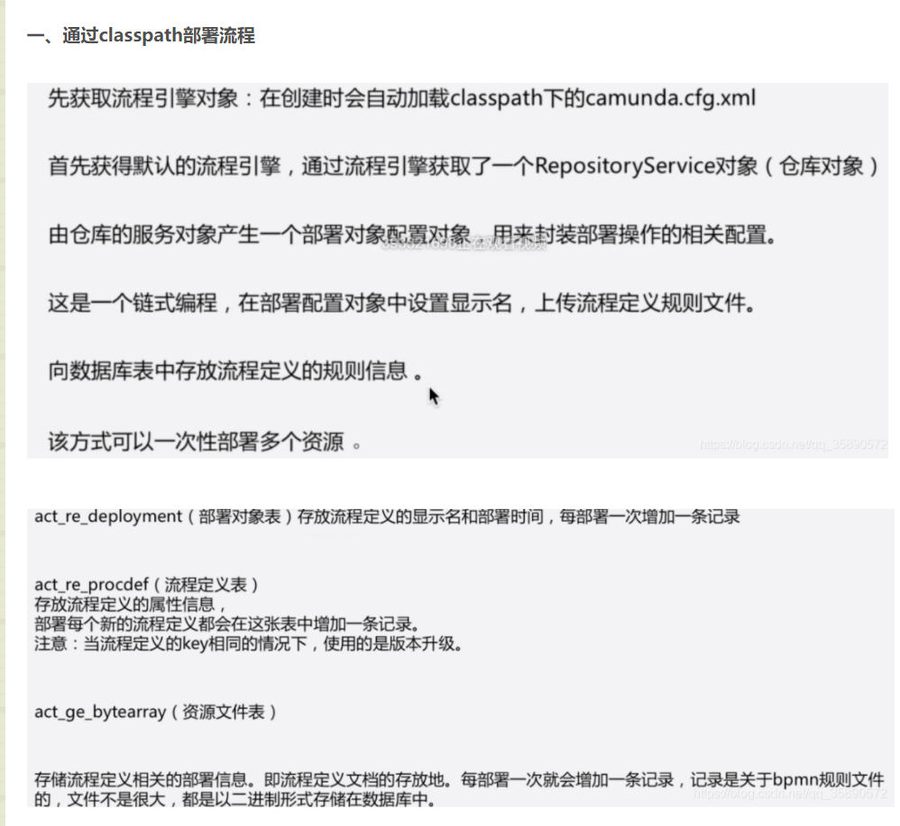

流程定义系列




```java
    @Test
    public void addString() {
        String resoueceName = "3.bpmn";
        String text = IOUtil.fileAsString("/Users/zhoupeng/IdeaProjects/activiti-demo/camunda/camunda-simple/src/main/resources/com.demo/ch8/diagram_1.bpmn");
        DeploymentBuilder deploymentBuilder = repositoryService.createDeployment();
        Deployment deployment = deploymentBuilder
                .name("请求流程")
                .source("本地测试")
                .tenantId("a")
                .addString(resoueceName, text)
                .deploy();

        System.out.println(deploymentBuilder);
        System.out.println(deployment);
    }

```


三、流与压缩流部署
```java
 @Test
    public void addInputStream() {
        String resoueceName = "3.bpmn";

        InputStream inputStream = DeploymentTest.class.getClassLoader().getResourceAsStream("com.demo/ch8/diagram_1.bpmn");

        DeploymentBuilder deploymentBuilder = repositoryService.createDeployment();
        Deployment deployment = deploymentBuilder
                .name("请求流程")
                .source("本地测试")
                .tenantId("a")
                .addInputStream(resoueceName, inputStream)
                .deploy();

        System.out.println(deploymentBuilder);
        System.out.println(deployment);
    }


    @Test
    public void addZipInputStream() {

        InputStream inputStream = DeploymentTest.class.getClassLoader().getResourceAsStream("com.demo/ch8/diagram_1.bpmn.zip");

        ZipInputStream zipInputStream = new ZipInputStream(inputStream);

        DeploymentBuilder deploymentBuilder = repositoryService.createDeployment();
        Deployment deployment = deploymentBuilder
                .name("请求流程")
                .source("本地测试")
                .tenantId("a")
                .addZipInputStream(zipInputStream)
                .deploy();

        System.out.println(deploymentBuilder);
        System.out.println(deployment);
    }

```

.png)
```

    @Test
    public void addDeploymentResourceById() {
        String deploymentId = "3801";
        String resourceId = "3802";

        DeploymentBuilder deploymentBuilder = repositoryService.createDeployment();
        Deployment deployment = deploymentBuilder
                .name("请求流程")
                .source("本地测试")
                .tenantId("a")
                .addDeploymentResourceById(deploymentId, resourceId)
                .deploy();

        System.out.println(deploymentBuilder);
        System.out.println(deployment);
    }

```


五、流程定义及资源批删除

```java
  /**
     * delete from ACT_RU_IDENTITYLINK where PROC_DEF_ID_ = ?
     * delete from ACT_RE_PROCDEF where ID_ = ?
     * DELETE FROM ACT_RU_JOBDEF where PROC_DEF_ID_ = ?
     */
    @Test
    public void deleteProcessDefinition() {
        String processDefinationId = "leave:7:4003";
        repositoryService.deleteProcessDefinition(processDefinationId);
    }


    /**
     * delete from ACT_RU_IDENTITYLINK where PROC_DEF_ID_ = ?
     * delete B from ACT_GE_BYTEARRAY B inner join ACT_HI_JOB_LOG J on B.ID_ = J.JOB_EXCEPTION_STACK_ID_ and J.JOB_EXCEPTION_STACK_ID_ is not null and J.PROCESS_DEF_ID_ = ?
     * delete from ACT_RE_PROCDEF where ID_ = ?
     * delete from ACT_HI_INCIDENT where PROC_DEF_ID_ = ? and PROC_INST_ID_ is null
     * delete from ACT_HI_JOB_LOG where PROCESS_DEF_ID_ = ?
     * DELETE FROM ACT_RU_JOBDEF where PROC_DEF_ID_ = ?
     */
    @Test
    public void deleteProcessDefinitionCascade() {
        String processDefinationId = "leave:6:3903";
        boolean cascade = true;
        repositoryService.deleteProcessDefinition(processDefinationId, cascade);
    }


    @Test
    public void deleteProcessDefinitions() {
        String processDefinationId = "leave:6:3903";
        DeleteProcessDefinitionsSelectBuilder deleteProcessDefinitionsSelectBuilder = repositoryService.deleteProcessDefinitions();
        deleteProcessDefinitionsSelectBuilder.byIds(processDefinationId,processDefinationId).cascade().delete();
    }

```
删除部署：
```java

    @Test
    public void deleteDeployment() {
        String deploymentId = "";
        repositoryService.deleteDeployment(deploymentId);
    }

```

六、获取流程定义文档资源
```java
    @Test
    public void getProcessModel() throws IOException {
        String processDefinitionId = "leave:5:3803";
        InputStream inputStream = repositoryService.getProcessModel(processDefinitionId);
        FileUtils.copyInputStreamToFile(inputStream, new File("/Users/zhoupeng/IdeaProjects/activiti-demo/camunda/camunda-simple/src/main/resources/com.demo/ch8/tmp.txt"));
    }


    @Test
    public void getProcessDiagram() throws IOException {
        String processDefinitionId = "leave:5:3803";
        InputStream inputStream = repositoryService.getProcessDiagram(processDefinitionId);
        FileUtils.copyInputStreamToFile(inputStream, new File("/Users/zhoupeng/IdeaProjects/activiti-demo/camunda/camunda-simple/src/main/resources/com.demo/ch8/tem.png"));
    }


```


七、流程定义文档、图片、坐标获取
```java
/**
     * select * from ACT_RE_PROCDEF where ID_ = ?   leave:5:3803(String)
     * select * from ACT_RE_DEPLOYMENT where ID_ = ?  3801(String)
     * select * from ACT_GE_BYTEARRAY where DEPLOYMENT_ID_ = ? and NAME_ = ?   3801(String), diagram_1.bpmn
     * select * from ACT_RE_PROCDEF where DEPLOYMENT_ID_ = ? and KEY_ = ?  3801(String), leave(String)
     * select * from ACT_RE_PROCDEF RES where KEY_ = ? and TENANT_ID_ = ? and VERSION_ = ( select max(VERSION_) from ACT_RE_PROCDEF where KEY_ = ? and TENANT_ID_ = ?)
     * leave(String), a(String), leave(String), a(String)
     */
    @Test
    public void getProcessModel() throws IOException {
        String processDefinitionId = "leave:5:3803";
        InputStream inputStream = repositoryService.getProcessModel(processDefinitionId);
        FileUtils.copyInputStreamToFile(inputStream, new File("/Users/zhoupeng/IdeaProjects/activiti-demo/camunda/camunda-simple/src/main/resources/com.demo/ch8/tmp.txt"));
    }


    @Test
    public void getProcessDiagram() throws IOException {
        String processDefinitionId = "leave:5:3803";
        InputStream inputStream = repositoryService.getProcessDiagram(processDefinitionId);
        FileUtils.copyInputStreamToFile(inputStream, new File("/Users/zhoupeng/IdeaProjects/activiti-demo/camunda/camunda-simple/src/main/resources/com.demo/ch8/tem.png"));
    }


    /**
     * select distinct RES.* from ACT_RE_DEPLOYMENT RES order by RES.ID_ asc LIMIT ? OFFSET ?
     */
    @Test
    public void createDeploymentQuery() throws IOException {
        DeploymentQuery deploymentQuery = repositoryService.createDeploymentQuery();
        List<Deployment> list = deploymentQuery.list();
        for (Deployment deployment : list) {
            System.out.println(deployment.toString());
        }
    }


    @Test
    public void getProcessDiagramLayout() throws IOException {
        String processDefinitionId = "paiche:1:503";

        DiagramLayout diagramLayout = repositoryService.getProcessDiagramLayout(processDefinitionId);

        Map<String, DiagramElement> elements = diagramLayout.getElements();
        Set<Map.Entry<String, DiagramElement>> entries = elements.entrySet();

        for (Map.Entry<String, DiagramElement> entry : entries) {
            String key = entry.getKey();
            DiagramElement value = entry.getValue();

            System.out.println(key + "," + value.getId());
        }

        DeploymentQuery deploymentQuery =
                (DeploymentQuery) diagramLayout;
        List<Deployment> list = deploymentQuery.list();
        for (Deployment deployment : list) {
            System.out.println(deployment.toString());
        }
    }

```


八、自定义模型方式部署
```java
/**
     * insert into ACT_RE_DEPLOYMENT(ID_, NAME_, DEPLOY_TIME_, SOURCE_, TENANT_ID_) values(?, ?, ?, ?, ?)
     * insert into ACT_GE_BYTEARRAY( ID_, NAME_, BYTES_, DEPLOYMENT_ID_, GENERATED_, TENANT_ID_, TYPE_, CREATE_TIME_, REV_) values ( ?, ?, ?, ?, ?, ?, ?, ?, 1)
     * insert into ACT_RE_PROCDEF(ID_, CATEGORY_, NAME_, KEY_, VERSION_, DEPLOYMENT_ID_, RESOURCE_NAME_, DGRM_RESOURCE_NAME_, HAS_START_FORM_KEY_, SUSPENSION_STATE_, TENANT_ID_, VERSION_TAG_, HISTORY_TTL_, STARTABLE_, REV_) values (?, ?, ?, ?, ?, ?, ?, ?, ?, ?, ?, ?, ?, ?, 1 )
     */
    @Test
    public void createExecutableProcess() throws IOException {
        BpmnModelInstance bpmnModelInstance = Bpmn.createExecutableProcess("leave")
                .startEvent().name("开始节点")
                .userTask("申请人").camundaCandidateUsers("张三")
                .exclusiveGateway().name("排他网关").condition("小于三天", "${day<3}")
                .userTask().name("组长审批").camundaCandidateUsers("张三")
                .endEvent()

                .findLastGateway()
                .builder().condition("大于等于三天", "${day>=3}")
                .userTask().name("组长审批").camundaCandidateUsers("李四")
                .userTask().name("项目经理审批").camundaCandidateUsers("王五")
                .endEvent()

                .done();

        repositoryService.createDeployment()
                .addModelInstance("customer.bpmn", bpmnModelInstance)
                .deploy();

    }

```

获取模型，编辑 再部署
```java
    @Test
    public void getBpmnModelInstance() throws IOException {
        String processDefinitionId = "leave:8:4303";

        BpmnModelInstance bpmnModelInstance = repositoryService.getBpmnModelInstance(processDefinitionId);
        Collection<UserTask> modelElementsByType = bpmnModelInstance.getModelElementsByType(UserTask.class);

        System.out.println("###########" + modelElementsByType);


        DeploymentBuilder deploymentBuilder = repositoryService.createDeployment();
        deploymentBuilder
                .addModelInstance("customer.bpmn", bpmnModelInstance).deploy();
    }


```
