##RuntimeService : 
  该类核心功能是启动实例，查询与实例相关的一些信息。
  流程定义类似我们提前制定好了规则，让规则开始运转的过程就是实例运转的过程。
  类似我们Java中实例化一个类的 对象，然后操作这个实例对象。

  是camunda的流程 执行服务 类，可以从这个服务类中获取很多关于流程执行相关的信息。
  实现类是 RuntimeServiceImpl，提供了一系列根据自身业务场景启动流程实例的api。
  可以根据不同的api启动实例，并返回ProcessInstance对象。
  可以异步删除所有实例，并返回Batch对象。
  可以获取变量信息，并返回VariableMap对象
  可以获取变量信息，并返回Map<String,Object>对象。
  可以获取单个变量信息，并返回TypedValue对象。
  可以查询执行实例，返回ExecutionQuery对象。
  可以自定义SQL查询执行实例，返回NativeExecutionQuery对象。
  可以查询流程实例信息，返回ProcessInstanceQuery对象。
  可以自定义SQL查询流程实例信息，返回NativeProcessInstanceQuery对象。
  可以查询Incident相关信息，返回Incident对象。
  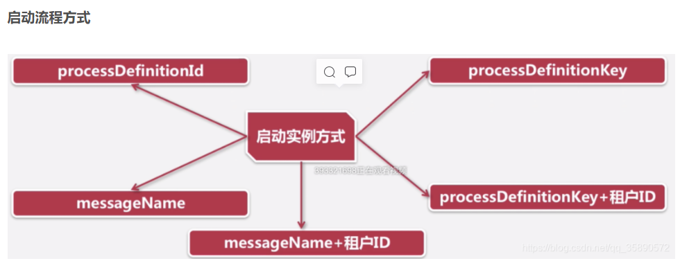
  
  ##一、执行实例流程三个经典案例
  ###流程定义：
  流程定义类，可以从这里获取资源文件等，也就是我们提前定义好的规则，类似我们提前定义的Java类，提前定义一系列的规则。
  ###流程实例：
  流程实例不会运转，执行实例才会运转。
  代表流程定义的执行实例。如学生张三请了一天假，他就必须发出一个流程实例的申请，如果不发起流程，实例不会运转。
  一个流程实例包含了所有的运行节点，我们可以利用当前这个对象来了解当前流程实例的进度等信息。
  流程实例就表示一个流程从开始到结束的最大的流程分支，即一个流程中流程实例只有一个。
  流程实例通常也叫做执行实例的根节点。
  ###执行实例
  ```java
public interface ProcessInstance extends Execution {}
```
 从源码中看出流程实例 ProcessInstance 就是 Execution，
 启动流程的时候，会首先创建流程实例，（如果存在子流程、多实例、并行网关）会再次创建执行实例，
 流程运转的过程，永远执行的是自己对应的执行实例。
 当所有执行实例按照规则执行完毕之后，实例也随之结束。
 camunda用这个对象去描述流程执行的每一个节点，
 流程按照流程定义的规则执行一次的过程，就可以表示执行对象Execution。
 一个流程中，执行对象可以有多个，但是流程实例只能有一个。
 执行实例的父级或者父级的父级为流程实例。
 执行实例可能暂定到某一个活动节点，需要我们通过特定的api去完成，然后执行实例继续往下走。
 
 
 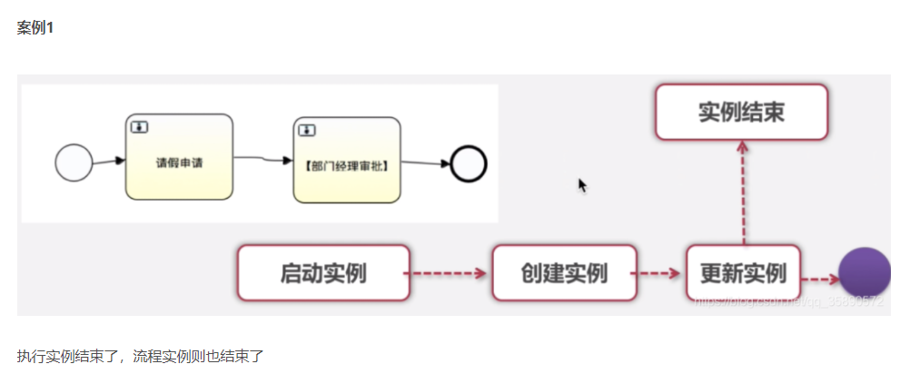
 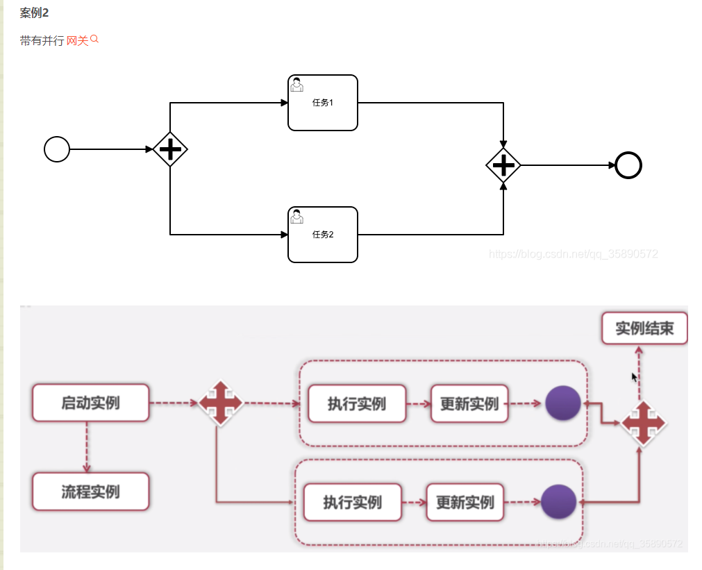
 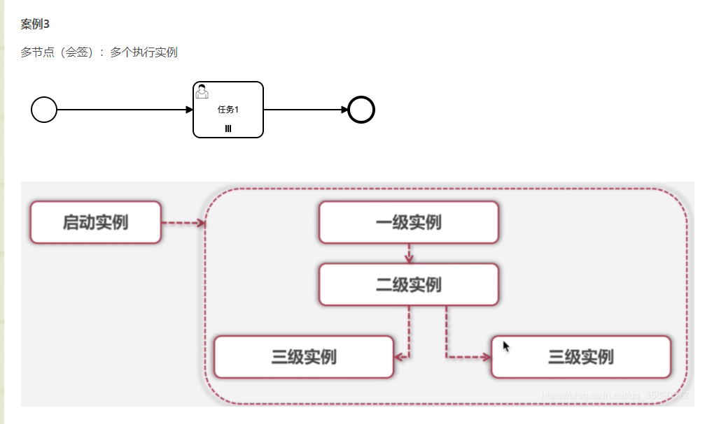
  
  ##二、流程实例启动设计到的表说明
  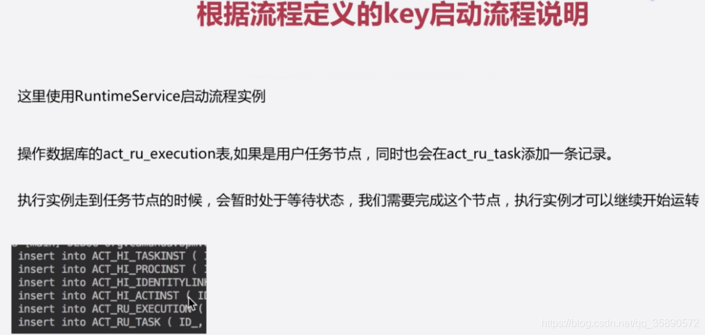
  
  ```java
/**
     * insert into ACT_HI_TASKINST ( ID_, PROC_DEF_KEY_, PROC_DEF_ID_, ROOT_PROC_INST_ID_, PROC_INST_ID_, EXECUTION_ID_, CASE_DEF_KEY_, CASE_DEF_ID_, CASE_INST_ID_, CASE_EXECUTION_ID_, ACT_INST_ID_, NAME_, PARENT_TASK_ID_, DESCRIPTION_, OWNER_, ASSIGNEE_, START_TIME_, END_TIME_, DURATION_, DELETE_REASON_, TASK_DEF_KEY_, PRIORITY_, DUE_DATE_, FOLLOW_UP_DATE_, TENANT_ID_, REMOVAL_TIME_ ) values ( ?, ?, ?, ?, ?, ?, ?, ?, ?, ?, ?, ?, ?, ?, ?, ?, ?, ?, ?, ?, ?, ?, ?, ?, ?, ? )
     * insert into ACT_HI_PROCINST ( ID_, PROC_INST_ID_, BUSINESS_KEY_, PROC_DEF_KEY_, PROC_DEF_ID_, START_TIME_, END_TIME_, REMOVAL_TIME_, DURATION_, START_USER_ID_, START_ACT_ID_, END_ACT_ID_, SUPER_PROCESS_INSTANCE_ID_, ROOT_PROC_INST_ID_, SUPER_CASE_INSTANCE_ID_, CASE_INST_ID_, DELETE_REASON_, TENANT_ID_, STATE_ ) values ( ?, ?, ?, ?, ?, ?, ?, ?, ?, ?, ?, ?, ?, ?, ?, ?, ?, ?, ? )
     * insert into ACT_HI_IDENTITYLINK ( ID_, TIMESTAMP_, TYPE_, USER_ID_, GROUP_ID_, TASK_ID_, ROOT_PROC_INST_ID_, PROC_DEF_ID_, OPERATION_TYPE_, ASSIGNER_ID_, PROC_DEF_KEY_, TENANT_ID_, REMOVAL_TIME_) values (?, ?, ?, ?, ?, ?, ?, ?, ?, ?, ?, ?, ? )
     * insert into ACT_HI_ACTINST ( ID_, PARENT_ACT_INST_ID_, PROC_DEF_KEY_, PROC_DEF_ID_, ROOT_PROC_INST_ID_, PROC_INST_ID_, EXECUTION_ID_, ACT_ID_, TASK_ID_, CALL_PROC_INST_ID_, CALL_CASE_INST_ID_, ACT_NAME_, ACT_TYPE_, ASSIGNEE_, START_TIME_, END_TIME_, DURATION_, ACT_INST_STATE_, SEQUENCE_COUNTER_, TENANT_ID_, REMOVAL_TIME_ ) values ( ?, ?, ?, ?, ?, ?, ?, ?, ?, ?, ?, ?, ?, ?, ?, ?, ?, ?, ?, ?, ? )
     * insert into ACT_RU_EXECUTION ( ID_, ROOT_PROC_INST_ID_, PROC_INST_ID_, BUSINESS_KEY_, PROC_DEF_ID_, ACT_ID_, ACT_INST_ID_, IS_ACTIVE_, IS_CONCURRENT_, IS_SCOPE_, IS_EVENT_SCOPE_, PARENT_ID_, SUPER_EXEC_, SUPER_CASE_EXEC_, CASE_INST_ID_, SUSPENSION_STATE_, CACHED_ENT_STATE_, SEQUENCE_COUNTER_, TENANT_ID_, REV_ ) values ( ?, ?, ?, ?, ?, ?, ?, ?, ?, ?, ?, ?, ?, ?, ?, ?, ?, ?, ?, 1 )
     * insert into ACT_RU_TASK ( ID_, NAME_, PARENT_TASK_ID_, DESCRIPTION_, PRIORITY_, CREATE_TIME_, OWNER_, ASSIGNEE_, DELEGATION_, EXECUTION_ID_, PROC_INST_ID_, PROC_DEF_ID_, CASE_EXECUTION_ID_, CASE_INST_ID_, CASE_DEF_ID_, TASK_DEF_KEY_, DUE_DATE_, FOLLOW_UP_DATE_, SUSPENSION_STATE_, TENANT_ID_, REV_ ) values ( ?, ?, ?, ?, ?, ?, ?, ?, ?, ?, ?, ?, ?, ?, ?, ?, ?, ?, ?, ?, 1 )
     */
    @Test
    public void startProcessInstanceByKey() {
        String processInstanceByKey = "leave";
        ProcessInstance processInstance = runtimeService.startProcessInstanceByKey(processInstanceByKey);
        System.out.println(processInstance.getId() + "," + processInstance.getBusinessKey() + "," + processInstance.getProcessDefinitionId());
    }


```
  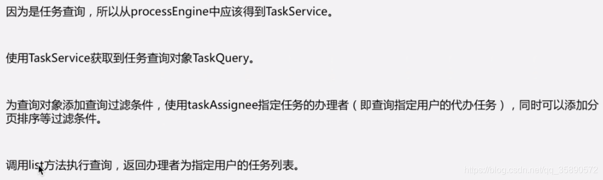
  ```java
    /**
     * select distinct RES.REV_, RES.ID_, RES.NAME_, RES.PARENT_TASK_ID_,
     * RES.DESCRIPTION_, RES.PRIORITY_, RES.CREATE_TIME_,
     * RES.OWNER_, RES.ASSIGNEE_, RES.DELEGATION_, RES.EXECUTION_ID_,
     * RES.PROC_INST_ID_, RES.PROC_DEF_ID_, RES.CASE_EXECUTION_ID_,
     * RES.CASE_INST_ID_, RES.CASE_DEF_ID_, RES.TASK_DEF_KEY_, RES.DUE_DATE_,
     * RES.FOLLOW_UP_DATE_, RES.SUSPENSION_STATE_,
     * RES.TENANT_ID_ from ACT_RU_TASK RES WHERE ( 1 = 1 and RES.ASSIGNEE_ = ? ) order by RES.ID_ asc LIMIT ? OFFSET ?
     * 张三(String), 2147483647(Integer), 0(Integer)
     */
    @Test
    public void createTaskQuery() {
        TaskQuery taskQuery = taskService.createTaskQuery()
                .taskAssignee("张三");
        List<Task> list = taskQuery.list();
        for (Task task : list) {
            System.out.println(task.getId());
        }
    }

```
    
 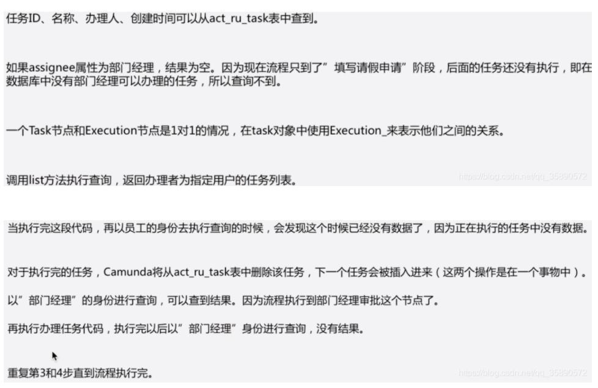    
 
 ##三、从任意节点启动实例
  ```java
    @Test
    public void createProcessInstanceByKey() {
        String processInstanceByKey = "leave";
        String activityId = "Activity_1r8r4jn";

        ProcessInstantiationBuilder processInstantiationBuilder = runtimeService.createProcessInstanceByKey(processInstanceByKey);
        ProcessInstance processInstance = processInstantiationBuilder.businessKey("001")
                //某节点之前开始
                .startBeforeActivity(activityId)
                .execute();
        System.out.println(processInstance.getId() + "," + processInstance.getBusinessKey() + "," + processInstance.getProcessDefinitionId());

    }


    @Test
    public void createProcessInstanceByKey2() {
        String processInstanceByKey = "leave";
        String activityId = "Flow_1c279og";

        ProcessInstantiationBuilder processInstantiationBuilder = runtimeService.createProcessInstanceByKey(processInstanceByKey);
        ProcessInstance processInstance = processInstantiationBuilder.businessKey("001")
                //从连线开始触发
                .startTransition(activityId)
                .execute();
        System.out.println(processInstance.getId() + "," + processInstance.getBusinessKey() + "," + processInstance.getProcessDefinitionId());

    }


    @Test
    public void createProcessInstanceByKey3() {
        String processInstanceByKey = "leave";
        String activityId = "Activity_0zafxq7";

        ProcessInstantiationBuilder processInstantiationBuilder = runtimeService.createProcessInstanceByKey(processInstanceByKey);
        ProcessInstance processInstance = processInstantiationBuilder.businessKey("001")
                //某节点之后
                .startAfterActivity(activityId)
                .execute();
        System.out.println(processInstance.getId() + "," + processInstance.getBusinessKey() + "," + processInstance.getProcessDefinitionId());

    }

    @Test
    public void createProcessInstanceByKey4() {
        String processInstanceByKey = "leave";
        String activityId = "Activity_0zafxq7";

        //跳过监听器
        boolean skipCustomListeners = true;
        boolean skipIoMappings = true;

        ProcessInstantiationBuilder processInstantiationBuilder = runtimeService.createProcessInstanceByKey(processInstanceByKey);
        ProcessInstance processInstance = processInstantiationBuilder.businessKey("001")
                .startAfterActivity(activityId)
                .execute(skipCustomListeners, skipIoMappings);
        System.out.println(processInstance.getId() + "," + processInstance.getBusinessKey() + "," + processInstance.getProcessDefinitionId());

    }
    @Test
    public void createProcessInstanceByKey() {
        String processInstanceByKey = "leave";
        String activityId = "Activity_1r8r4jn";

        ProcessInstantiationBuilder processInstantiationBuilder = runtimeService.createProcessInstanceByKey(processInstanceByKey);
        ProcessInstance processInstance = processInstantiationBuilder.businessKey("001")
                .startBeforeActivity(activityId)
                .execute();
        System.out.println(processInstance.getId() + "," + processInstance.getBusinessKey() + "," + processInstance.getProcessDefinitionId());

    }


    @Test
    public void createProcessInstanceByKey2() {
        String processInstanceByKey = "leave";
        String activityId = "Flow_1c279og";

        ProcessInstantiationBuilder processInstantiationBuilder = runtimeService.createProcessInstanceByKey(processInstanceByKey);
        ProcessInstance processInstance = processInstantiationBuilder.businessKey("001")
                .startTransition(activityId)
                .execute();
        System.out.println(processInstance.getId() + "," + processInstance.getBusinessKey() + "," + processInstance.getProcessDefinitionId());

    }

```

通过节点ID启动与通过连线ID启动有什么区别？

实际项目中连线可以配置执行监听器，走连线可以触发监听器

```java
//ACT_RU_TASK : 正在执行的任务信息
    /**
     * select distinct RES.REV_, RES.ID_, RES.NAME_, RES.PARENT_TASK_ID_,
     * RES.DESCRIPTION_, RES.PRIORITY_, RES.CREATE_TIME_,
     * RES.OWNER_, RES.ASSIGNEE_, RES.DELEGATION_, RES.EXECUTION_ID_,
     * RES.PROC_INST_ID_, RES.PROC_DEF_ID_, RES.CASE_EXECUTION_ID_,
     * RES.CASE_INST_ID_, RES.CASE_DEF_ID_, RES.TASK_DEF_KEY_, RES.DUE_DATE_,
     * RES.FOLLOW_UP_DATE_, RES.SUSPENSION_STATE_,
     * RES.TENANT_ID_ from ACT_RU_TASK RES WHERE ( 1 = 1 and RES.ASSIGNEE_ = ? ) order by RES.ID_ asc LIMIT ? OFFSET ?
     * 张三(String), 2147483647(Integer), 0(Integer)
     */
    @Test
    public void createTaskQuery() {
        TaskQuery taskQuery = taskService.createTaskQuery()
                .taskAssignee("list");
        List<Task> list = taskQuery.list();
        for (Task task : list) {
            System.out.println(task.getId());
        }
    }
```
##四、历史数据5张表说明及实例跟踪
查询流程状态：正在执行，还是结束
在流程执行的过程中，创建的流程实例id在整个过程中都不会变，当流程结束后，流程实将会在正在执行的执行对象表（act_ru_execution）中删除。
ACT_RU_EXECUTION ：正在执行的信息
```java
 /**
     *
     *  select distinct RES.* from ACT_RU_EXECUTION RES inner join
     *  ACT_RE_PROCDEF P on RES.PROC_DEF_ID_ = P.ID_ WHERE
     *
     *  RES.PARENT_ID_ is null and RES.PROC_INST_ID_ = ? order by RES.ID_ asc LIMIT ? OFFSET ?
     */
    @Test
    public void createProcessInstanceQuery() {
        String processInstanceId = "9390f496-a4e1-11ec-a216-88b11139d73a";
        ProcessInstance processInstance = runtimeService.createProcessInstanceQuery()
                .processInstanceId(processInstanceId)
                //结果唯一的，可以用single，如果大于1，则会报错
                .singleResult();
        if (processInstance == null) {
            System.out.println("当前实例已经结束了");
        } else {
            System.out.println("当前实例正在运转");
        }
    }

```
    
 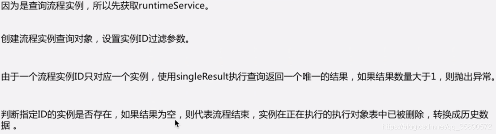    
 
 ### ACT_HI_PROCINST表：历史流程实例与运行流程实例是一对一的关系，存放已经执行完的历史流程实例信息
```java
 /**
     * select distinct RES.* from
     * ( SELECT SELF.*, DEF.NAME_, DEF.VERSION_ FROM ACT_HI_PROCINST
     * SELF LEFT JOIN ACT_RE_PROCDEF DEF ON SELF.PROC_DEF_ID_ = DEF.ID_
     * <p>
     * WHERE SELF.PROC_INST_ID_ = ? and STATE_ = ? ) RES order by RES.ID_ asc LIMIT ? OFFSET ?
     */
    @Test
    public void createHistoricProcessInstanceQuery() {
        String processInstanceId = "9390f496-a4e1-11ec-a216-88b11139d73a";
        HistoricProcessInstance historicProcessInstance = historyService.createHistoricProcessInstanceQuery()
//                .completed()
                .processInstanceId(processInstanceId)
                .singleResult();

        if (historicProcessInstance.getEndTime() != null) {
            System.out.println("当前实例结束了");
        } else {
            System.out.println("当前实例正在运转");
        }


    }
```
###历史活动表是：ACT_HI_ACTINST，活动节点数据都会存在这个表中，存放历史所有完成的活动
```java
 /**
     * select RES.* FROM ACT_HI_ACTINST RES WHERE RES.PROC_INST_ID_ = ? order by RES.ID_ asc LIMIT ? OFFSET ?
     */
    @Test
    public void createHistoricActivityInstanceQuery() {
        String processInstanceId = "9390f496-a4e1-11ec-a216-88b11139d73a";
        List<HistoricActivityInstance> list = historyService.createHistoricActivityInstanceQuery()
                .processInstanceId(processInstanceId)
                .list();

        for (HistoricActivityInstance historicActivityInstance : list) {
            System.out.println(historicActivityInstance.toString());
        }
    }
```

### 历史任务表：ACT_HI_TASKINST： 已经执行完的历史任务信息
   ```java
 /**
     * select distinct RES.* from ACT_HI_TASKINST RES WHERE RES.PROC_INST_ID_ = ? order by RES.ID_ asc LIMIT ? OFFSET ?
     */
    @Test
    public void createHistoricTaskInstanceQuery() {
        String processInstanceId = "9390f496-a4e1-11ec-a216-88b11139d73a";
        List<HistoricTaskInstance> list = historyService.createHistoricTaskInstanceQuery()
                .processInstanceId(processInstanceId)
                .list();
        for (HistoricTaskInstance historicTaskInstance : list) {
            System.out.println(historicTaskInstance);
        }
    }
```

 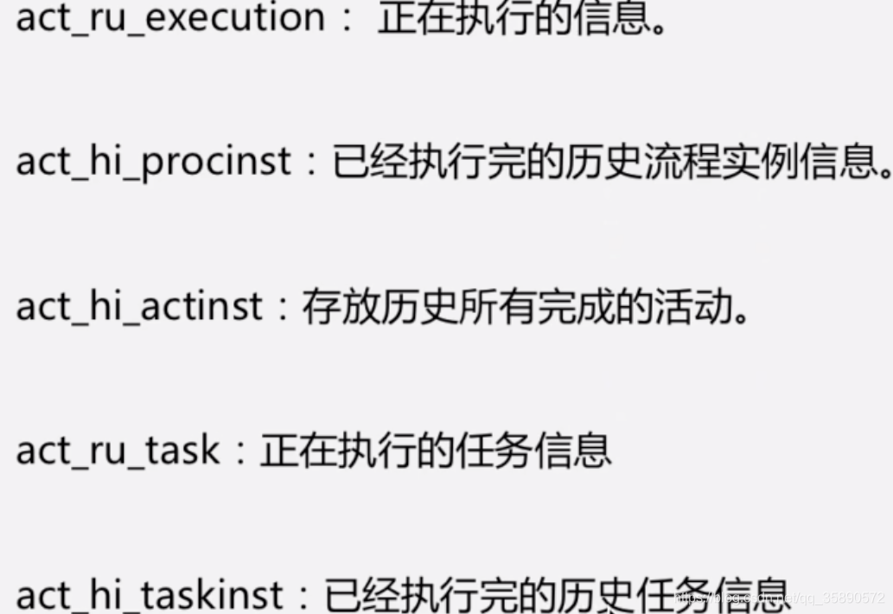    
 
 
 ## 五、流程发起人及initiator设置
     关闭租户校验
```java
 <bean id="processEngineConfiguration"
          class="org.camunda.bpm.engine.impl.cfg.StandaloneInMemProcessEngineConfiguration">

        <property name="jdbcUrl" value="jdbc:mysql://127.0.0.1/camunda"/>
        <property name="jdbcDriver" value="com.mysql.jdbc.Driver"/>
        <property name="jdbcUsername" value="root"/>
        <property name="jdbcPassword" value="123456"/>
        <property name="databaseSchemaUpdate" value="false"/>
        <property name="historyLevel" value="HISTORY_LEVEL_FULL"/>
        <property name="dbHistoryUsed" value="true"/>

        <!--关闭租户校验-->
        <property name="tenantCheckEnabled" value="false"/>
    </bean>
    @Test
    public void setAuthenticatedUserId() {
        identityService.setAuthenticatedUserId("peng1212");
        runtimeService.startProcessInstanceByKey("leave");
    }

```
在开始节点设置initiator
<bpmn:startEvent id="StartEvent_1" camunda:initiator="leaveinitiator">
设置后，后面的可以通过${leaveinitiator}来引用变量，initiator跟启动人配合使用才有意义，否则没有意义

##六、流程实例的删除


```java
 /**
     * delete from ACT_RU_IDENTITYLINK where ID_ = ?
     * delete from ACT_RU_TASK where ID_ = ? and REV_ = ?
     * delete from ACT_RU_EXECUTION where ID_ = ? and REV_ = ?
     * UPDATE ACT_HI_ACTINST SET EXECUTION_ID_ = ?, PROC_DEF_KEY_ = ?, PROC_DEF_ID_ = ?, ACT_ID_ = ?, ACT_NAME_ = ?, ACT_TYPE_ = ?, PARENT_ACT_INST_ID_ = ? , END_TIME_ = ? , DURATION_ = ? , ACT_INST_STATE_ = ? WHERE ID_ = ?
     * update ACT_HI_PROCINST set PROC_DEF_ID_ = ?, PROC_DEF_KEY_ = ?, BUSINESS_KEY_ = ?, END_ACT_ID_ = ?, DELETE_REASON_ = ?, SUPER_PROCESS_INSTANCE_ID_ = ?, STATE_ = ? , END_TIME_ = ? , DURATION_ = ? where ID_ = ?
     * update ACT_HI_TASKINST set EXECUTION_ID_ = ?, PROC_DEF_KEY_ = ?, PROC_DEF_ID_ = ?, NAME_ = ?, PARENT_TASK_ID_ = ?, DESCRIPTION_ = ?, OWNER_ = ?, ASSIGNEE_ = ?, DELETE_REASON_ = ?, TASK_DEF_KEY_ = ?, PRIORITY_ = ?, DUE_DATE_ = ?, FOLLOW_UP_DATE_ = ?, CASE_INST_ID_ = ? , END_TIME_ = ? , DURATION_ = ? where ID_ = ?
     */
    @Test
    public void deleteProcessInstance() {
        String processInstanceId = "5401";
        String reason = "测试删除";
        runtimeService.deleteProcessInstance(processInstanceId, reason);
    }


    @Test
    public void deleteProcessInstance2() {
        List<String> list = Lists.newArrayList("5701", "5901");
        runtimeService.deleteProcessInstances(list, "测试批量删除", true, true);
    }

```
### 获取正在运行的实例节点
```java
    /**
     * select * from ACT_RU_EXECUTION where PROC_INST_ID_ = ?
     */
    @Test
    public void getActiveActivityIds() {
        //执行实例ID
        String executionId = "6001";
        List<String> activeActivityIds = runtimeService.getActiveActivityIds(executionId);
        System.out.println("####" + activeActivityIds);
    }


    @Test
    public void getActivityInstance() {
        //执行实例ID
        String processInstanceId = "6001";
        ActivityInstance activityInstance = runtimeService.getActivityInstance(processInstanceId);
        System.out.println(activityInstance);
    }


```
## 八、流程定义的挂起与激活
    流程定义挂起以后就不能再启动了

  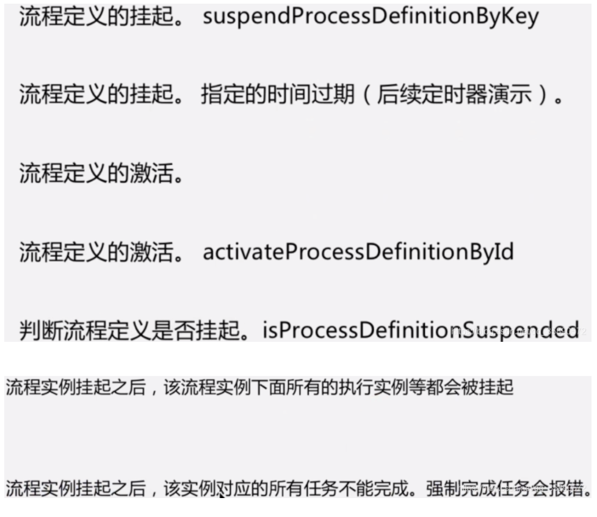
   ```java
/**
     * update ACT_RE_PROCDEF set REV_ = REV_ + 1, SUSPENSION_STATE_ = ? WHERE ID_ = ?
     * 2(Integer), leave:1:5103(String)
     * update ACT_RU_JOBDEF set REV_ = REV_ + 1, SUSPENSION_STATE_ = ? WHERE PROC_DEF_ID_ = ?
     */
    @Test
    public void suspendProcessDefinitionById() {
        //挂起流程定义
        String processDefinitionById = "leave:1:5103";
        //SUSPENSION_STATE_ 2代表被挂起了
        repositoryService.suspendProcessDefinitionById(processDefinitionById);
    }


    /**
     * update ACT_RE_PROCDEF set REV_ = REV_ + 1, SUSPENSION_STATE_ = ? WHERE ID_ = ?
     * 1(Integer), leave:1:5103(String)
     * <p>
     * update ACT_RU_JOBDEF set REV_ = REV_ + 1, SUSPENSION_STATE_ = ? WHERE PROC_DEF_ID_ = ?
     */
    @Test
    public void updateProcessDefinitionSuspensionState() {
        //激活流程定义
        String processDefinitionById = "leave:1:5103";
        repositoryService.updateProcessDefinitionSuspensionState()
                .byProcessDefinitionId(processDefinitionById)
                .activate();
    }


    /**
     * update ACT_RU_EXT_TASK SET SUSPENSION_STATE_ = ? WHERE PROC_DEF_ID_ = ?
     * update ACT_RU_JOB set REV_ = REV_ + 1, SUSPENSION_STATE_ = ? WHERE PROCESS_DEF_ID_ = ?
     * update ACT_RU_JOB set REV_ = REV_ + 1, SUSPENSION_STATE_ = ? WHERE PROCESS_DEF_ID_ = ? and HANDLER_TYPE_ = ?
     * update ACT_RU_TASK set REV_ = REV_ + 1, SUSPENSION_STATE_ = ?, CREATE_TIME_ = CREATE_TIME_ WHERE PROC_DEF_ID_ = ?
     * update ACT_RU_EXECUTION set REV_ = REV_ + 1, SUSPENSION_STATE_ = ? WHERE PROC_DEF_ID_ = ?
     * update ACT_RE_PROCDEF set REV_ = REV_ + 1, SUSPENSION_STATE_ = ? WHERE ID_ = ?
     * update ACT_HI_PROCINST set PROC_DEF_ID_ = ?, PROC_DEF_KEY_ = ?, BUSINESS_KEY_ = ?, END_ACT_ID_ = ?, DELETE_REASON_ = ?, SUPER_PROCESS_INSTANCE_ID_ = ?, STATE_ = ? where ID_ = ?
     * update ACT_RU_JOBDEF set REV_ = REV_ + 1, SUSPENSION_STATE_ = ? WHERE PROC_DEF_ID_ = ?
     */
    @Test
    public void activateProcessDefinitionById() {
        //激活流程定义 以及 流程实例
        String processDefinitionById = "leave:1:5103";
        repositoryService.updateProcessDefinitionSuspensionState()
                .byProcessDefinitionId(processDefinitionById)
                .includeProcessInstances(true)
                .activate();
    }


    /**
     * update ACT_RU_EXT_TASK SET SUSPENSION_STATE_ = ? WHERE PROC_INST_ID_ = ?
     * update ACT_RU_JOB set REV_ = REV_ + 1, SUSPENSION_STATE_ = ? WHERE PROCESS_INSTANCE_ID_ = ?
     * update ACT_RU_TASK set REV_ = REV_ + 1, SUSPENSION_STATE_ = ?, CREATE_TIME_ = CREATE_TIME_ WHERE PROC_INST_ID_ = ?
     * update ACT_RU_EXECUTION set REV_ = REV_ + 1, SUSPENSION_STATE_ = ? WHERE PROC_INST_ID_ = ?
     * ACT_HI_PROCINST set PROC_DEF_ID_ = ?, PROC_DEF_KEY_ = ?, BUSINESS_KEY_ = ?, END_ACT_ID_ = ?, DELETE_REASON_ = ?, SUPER_PROCESS_INSTANCE_ID_ = ?, STATE_ = ? where ID_ = ?
     */
    @Test
    public void suspendProcessInstanceById2() {
        //挂起流程实例
        runtimeService.suspendProcessInstanceById("5501");
    }


    @Test
    public void updateProcessInstanceSuspensionState() {
        ProcessInstanceQuery processInstanceQuery = runtimeService.createProcessInstanceQuery();
        //挂起流程实例,可以一次性挂起多个
        runtimeService.updateProcessInstanceSuspensionState()
        //.byProcessInstanceQuery(processInstanceQuery)//根据查询条件来挂起
                .byProcessInstanceId("5501")
        //.activate();//激活实例
                .suspend();
    }

    @Test
    public void activateProcessInstanceById() {
        //激活流程实例
        runtimeService.activateProcessInstanceById("5501");
    }

```

附：
新启动的流程，观察ACT_RU_EXECUTION表中：

PARENT_ID_字段有值为执行实例，流程实例为NULL；

ACT_ID_字段有值为执行实例，流程实例为NULL；

IS_ACTIVE_字段为0为流程实例，为1为执行实例。


##六、任务处理人动态添加与移除
动态添加候选人：
```java
    /**
     * insert into ACT_HI_IDENTITYLINK ( ID_, TIMESTAMP_, TYPE_, USER_ID_, GROUP_ID_, TASK_ID_, ROOT_PROC_INST_ID_, PROC_DEF_ID_, OPERATION_TYPE_, ASSIGNER_ID_, PROC_DEF_KEY_, TENANT_ID_, REMOVAL_TIME_) values (?, ?, ?, ?, ?, ?, ?, ?, ?, ?, ?, ?, ? )
     * insert into ACT_RU_IDENTITYLINK (ID_, TYPE_, USER_ID_, GROUP_ID_, TASK_ID_, PROC_DEF_ID_, TENANT_ID_, REV_ ) values (?, ?, ?, ?, ?, ?, ?, 1 )
     */
    @Test
    public void addCandidateUser() {
        String taskId = "9208";
        String userId = "帅哥4";
        taskService.addCandidateUser(taskId, userId);
    }

```
移除候选人：
```java
    /**
     * insert into ACT_HI_IDENTITYLINK ( ID_, TIMESTAMP_, TYPE_, USER_ID_, GROUP_ID_, TASK_ID_, ROOT_PROC_INST_ID_, PROC_DEF_ID_, OPERATION_TYPE_, ASSIGNER_ID_, PROC_DEF_KEY_, TENANT_ID_, REMOVAL_TIME_) values (?, ?, ?, ?, ?, ?, ?, ?, ?, ?, ?, ?, ? )
     * <p>
     * delete from ACT_RU_IDENTITYLINK where ID_ = ?
     */
    @Test
    public void deleteCandidateUser() {
        String taskId = "9208";
        String userId = "帅哥4";
        taskService.deleteCandidateUser(taskId, userId);
    }

```
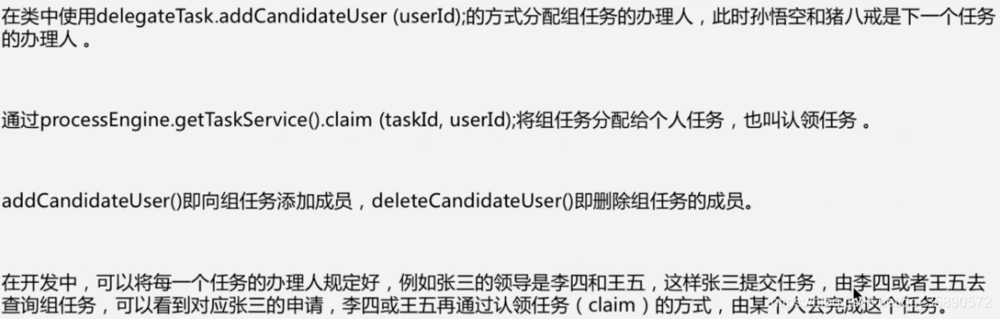

##七、角色组使用
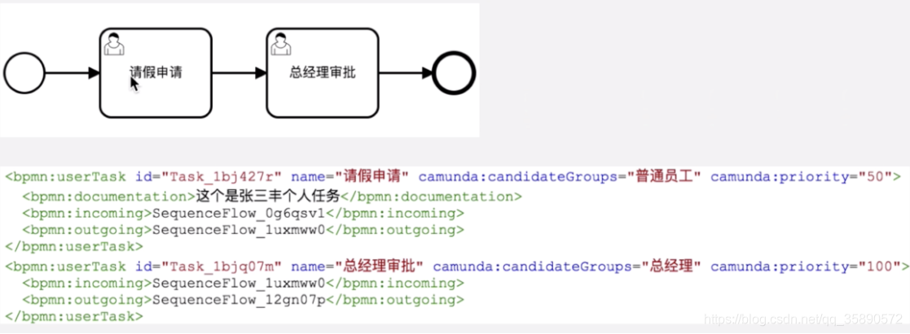
用户、组、用户与组关系 初始化：
```java
private void initGroupUser() {
        GroupEntity groupEntity1=new GroupEntity();
        groupEntity1.setRevision(0);
        groupEntity1.setName("普通员工");
        groupEntity1.setId("pt");
        identityService.saveGroup(groupEntity1);

        GroupEntity groupEntity2=new GroupEntity();
        groupEntity2.setRevision(0);
        groupEntity2.setName("总经理");
        groupEntity2.setId("GeneralManager");
        identityService.saveGroup(groupEntity2);

        UserEntity userEntity1=new UserEntity();
        userEntity1.setRevision(0);
        userEntity1.setId("zs");
        identityService.saveUser(userEntity1);

        UserEntity userEntity2=new UserEntity();
        userEntity2.setRevision(0);
        userEntity2.setId("ls");
        identityService.saveUser(userEntity2);

        UserEntity userEntity3=new UserEntity();
        userEntity3.setRevision(0);
        userEntity3.setId("ww");
        identityService.saveUser(userEntity3);

        identityService.createMembership("zs","GeneralManager");
        identityService.createMembership("ls","GeneralManager");
        identityService.createMembership("ww","pt");
    }

```


查询组任务列表

```java
 /**
     * SELECT DISTINCT
     * RES.REV_,RES.ID_,RES.NAME_,RES.PARENT_TASK_ID_,RES.DESCRIPTION_,RES.PRIORITY_,RES.CREATE_TIME_,RES.OWNER_,RES.ASSIGNEE_,RES.DELEGATION_,RES.EXECUTION_ID_,RES.PROC_INST_ID_,RES.PROC_DEF_ID_,RES.CASE_EXECUTION_ID_,RES.CASE_INST_ID_,RES.CASE_DEF_ID_,RES.TASK_DEF_KEY_,RES.DUE_DATE_,RES.FOLLOW_UP_DATE_,RES.SUSPENSION_STATE_,RES.TENANT_ID_
     * FROM
     * 	ACT_RU_TASK RES
     * 	INNER JOIN ACT_RU_IDENTITYLINK I ON I.TASK_ID_ = RES.ID_
     * WHERE
     * 	(
     * 		1 = 1
     * 		AND (
     * 			RES.ASSIGNEE_ IS NULL
     * 			AND I.TYPE_ = 'candidate'
     * 			AND ( I.GROUP_ID_ IN ( ? ) )
     * 		)
     * 	)
     * ORDER BY
     * 	RES.ID_ ASC
     * 	LIMIT ? OFFSET ?
     *
     */
    @Test
    public void findGroupTask2() {
        List<Task> taskList = taskService.createTaskQuery()
                .taskCandidateGroup("pt")
                .list();
        for (Task task : taskList) {
            System.out.println("#############");
            System.out.println(task.getId());
            System.out.println(task.getCreateTime());
            System.out.println(task.getPriority());
            System.out.println(task.getExecutionId());
            System.out.println("#############");
        }
    }


    /**
     * select distinct RES.REV_, RES.ID_, RES.NAME_, RES.PARENT_TASK_ID_, RES.DESCRIPTION_, 
     * RES.PRIORITY_, RES.CREATE_TIME_, RES.OWNER_, RES.ASSIGNEE_, RES.DELEGATION_, RES.EXECUTION_ID_,
     * RES.PROC_INST_ID_, RES.PROC_DEF_ID_, RES.CASE_EXECUTION_ID_, RES.CASE_INST_ID_, RES.CASE_DEF_ID_, RES.TASK_DEF_KEY_, RES.DUE_DATE_, 
     * RES.FOLLOW_UP_DATE_, RES.SUSPENSION_STATE_, RES.TENANT_ID_ 
     * from ACT_RU_TASK RES inner join ACT_RU_IDENTITYLINK I on I.TASK_ID_ = RES.ID_ 
     * WHERE ( 1 = 1 and ( RES.ASSIGNEE_ is null and I.TYPE_ = 'candidate' and ( I.USER_ID_ = ? or I.GROUP_ID_ IN ( ? ) ) ) ) order by RES.ID_ asc LIMIT ? OFFSET ? 
     */
    @Test
    public void findGroupTask3() {
        List<Task> taskList = taskService.createTaskQuery()
                .taskCandidateUser("ww") //I.USER_ID_ = ? or I.GROUP_ID_ IN ( ? )，查询候选人为自己的，与候选组包含自己的，同样都是taskCandidateUser，当user有了membership以后，查询的SQL就会多出来一部分包含Group的
                .list();
        for (Task task : taskList) {
            System.out.println("#############");
            System.out.println(task.getId());
            System.out.println(task.getCreateTime());
            System.out.println(task.getPriority());
            System.out.println(task.getExecutionId());
            System.out.println("#############");
        }
    }

```